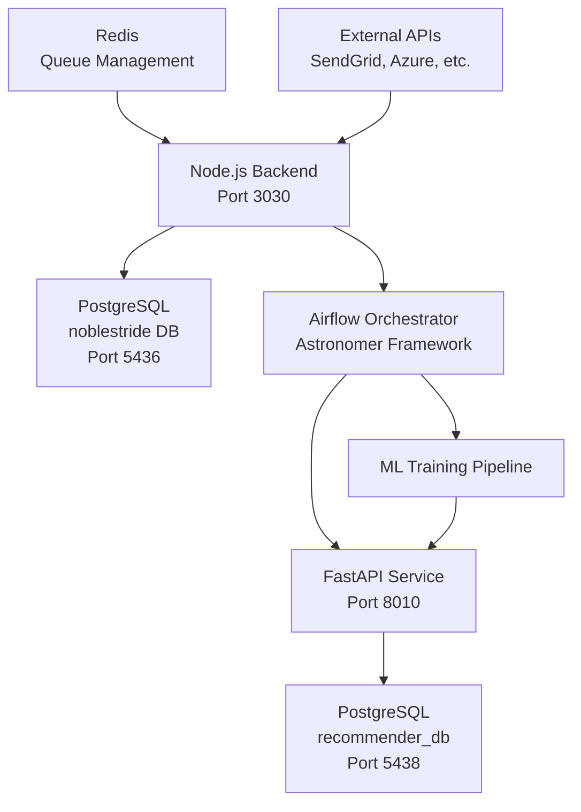

# 🚀 Investor-Business Recommender System
## Complete Documentation

### 📋 Table of Contents
1. [System Overview](#system-overview)
2. [Architecture](#architecture)
3. [Components](#components)
4. [API Documentation](#api-documentation)
5. [Airflow Workflows](#airflow-workflows)
6. [Database Schema](#database-schema)
7. [Deployment Guide](#deployment-guide)
8. [Testing Guide](#testing-guide)
9. [Monitoring & Troubleshooting](#monitoring--troubleshooting)

---

## 📊 System Overview

The **Investor-Business Recommender System** is a comprehensive machine learning platform that connects investors with suitable businesses and vice versa. The system combines **FastAPI** for real-time recommendations, **Apache Airflow** for ML pipeline orchestration, and **PostgreSQL** for data storage.

### 🎯 Key Features
- **Real-time Recommendations**: ML-powered matching between investors and businesses
- **Automated ML Pipelines**: Scheduled model training and data processing via Airflow  
- **Multi-Service Integration**: Seamless connection with Node.js backend (Noblestride)
- **RESTful API**: Comprehensive FastAPI endpoints for all operations
- **Scalable Architecture**: Docker-based containerization for easy deployment

### 🏗 High-Level Architecture



---

## 🏗 Architecture

### 🧩 Components Overview

| Component | Technology | Port | Purpose |
|-----------|------------|------|---------|
| **FastAPI Service** | Python 3.x, FastAPI | 8010 | Recommendation API & ML model serving |
| **Node.js Backend** | Node.js, Express | 3030 | Business logic, user management |
| **Airflow Orchestrator** | Apache Airflow, Astronomer | 8080 | ML pipeline orchestration |
| **PostgreSQL (Recommender)** | PostgreSQL 15 | 5438 | ML model data & recommendations |
| **PostgreSQL (Noblestride)** | PostgreSQL 15 | 5436 | Business & investor data |
| **Redis** | Redis | 6379 | Queue management & caching |

### 🔄 Data Flow

1. **Data Ingestion**: Node.js backend collects business & investor data
2. **Data Extraction**: Airflow DAGs extract data from Noblestride DB
3. **Preprocessing**: Data cleaning and feature engineering
4. **Model Training**: ML models trained on processed data
5. **Model Deployment**: Trained models deployed to FastAPI service
6. **Real-time Recommendations**: FastAPI serves recommendations via REST API

---

## 🚀 Components

### 1. FastAPI Recommendation Service

**Location**: `C:\Users\User\recommendation-service\`

#### 📂 Directory Structure
```
app/
├── api/                 # API routes
│   ├── businesses.py    # Business CRUD operations
│   ├── investors.py     # Investor management
│   ├── recommend.py     # Recommendation endpoints
│   ├── model.py         # ML model management
│   ├── ranking.py       # Ranking algorithms
│   ├── feedback.py      # User feedback handling
│   └── debug.py         # Debug utilities
├── core/               # Core configuration
│   ├── config.py       # Application settings
│   ├── logging_config.py # Logging setup
│   └── responses.py    # Custom response classes
├── db/                 # Database layer
│   ├── session.py      # Database connections
│   ├── base.py         # SQLAlchemy base
│   └── seed.py         # Data seeding
├── models/             # Data models
│   ├── db_models.py    # SQLAlchemy models
│   └── schemas.py      # Pydantic schemas
├── services/           # Business logic
│   ├── recommender.py  # Recommendation engine
│   ├── embeddings.py   # Text embeddings
│   └── feedback_logic.py # Feedback processing
└── ml/                 # Machine learning
    └── train.py        # Model training utilities
```

#### 🔧 Key Configuration Files

**`.env`** - Environment Variables:
```bash
# Database
DATABASE_URL=postgresql+psycopg2://postgres:password@db:5432/recommender_db
DB_USER=postgres
DB_PASSWORD=password
DB_NAME=recommender_db
DB_HOST=db
DB_PORT=5432

# Application
APP_NAME=RecommenderService
APP_VERSION=0.1.0
```

**`docker-compose.yml`** - Service Definition:
```yaml
services:
  api:
    build: .
    container_name: recommender_api
    ports:
      - "8010:8000"
    env_file:
      - .env
    environment:
      - DB_HOST=db
    depends_on:
      - db

  db:
    image: postgres:15
    container_name: recommender_db
    environment:
      POSTGRES_USER: ${DB_USER}
      POSTGRES_PASSWORD: ${DB_PASSWORD}
      POSTGRES_DB: ${DB_NAME}
    ports:
      - "5438:5432"
    volumes:
      - pgdata:/var/lib/postgresql/data
```

### 2. Airflow Orchestration Platform

**Location**: `C:\Users\User\recommendation-service\airflow-orchestrator\`

#### 🔄 Available DAGs

##### **Recommender Training Pipeline** (`recommender_training.py`)
- **Schedule**: Daily at 2:00 AM (`0 2 * * *`)
- **Purpose**: Train ML models using latest data
- **Tasks**:
  1. `check_fastapi_health` - Verify FastAPI service availability
  2. `extract_data` - Extract data from PostgreSQL
  3. `preprocess_data` - Clean and prepare training data
  4. `train_model` - Train ML models and notify FastAPI

##### **Noblestride Integration Pipeline** (`noblestride_integration.py`)
- **Schedule**: Every 6 hours (`0 */6 * * *`)
- **Purpose**: Sync data between Node.js backend and recommendation service
- **Tasks**:
  1. `check_services` - Health check for both services
  2. `extract_data` - Extract data from Noblestride database
  3. `sync_fastapi` - Send data summary to FastAPI
  4. `generate_report` - Create integration status report

### 3. Node.js Backend Integration

**Location**: `C:\Users\User\noblestride-backend\`

#### 🔌 Integration Points
- **Health Check**: `http://localhost:3030/`
- **API Documentation**: `http://localhost:3030/api-docs`
- **Database**: PostgreSQL on port 5436
- **Queue Dashboard**: `http://localhost:3030/admin/queues`

---

## 📚 API Documentation

### 🔗 Base URLs
- **FastAPI Service**: `http://localhost:8010`
- **Node.js Backend**: `http://localhost:3030`

### 🚀 FastAPI Endpoints

#### **System Health & Status**
```http
GET /health
GET /
```

**Response Example**:
```json
{
  "status": "ok",
  "service": "recommender",
  "version": "0.1.0"
}
```

#### **Model Management**
```http
GET /api/model/status
POST /api/model/training-complete
POST /api/model/trigger-training
GET /api/model/health
```

**Model Status Response**:
```json
{
  "status": "ready",
  "current_model_version": "v20250918_143000",
  "last_training": "2025-09-18T14:30:00",
  "message": "Model is ready for predictions"
}
```

#### **Business Operations**
```http
GET /api/businesses?limit=10&offset=0
POST /api/businesses
PUT /api/businesses/{business_id}
DELETE /api/businesses/{business_id}
```

#### **Investor Operations**  
```http
GET /api/investors?limit=10&offset=0
POST /api/investors
PUT /api/investors/{investor_id}
DELETE /api/investors/{investor_id}
```

#### **Recommendations**
```http
POST /api/recommend/businesses-for-investor
POST /api/recommend/investors-for-business
GET /api/recommend/trending
```

**Recommendation Request Example**:
```json
{
  "investor_id": "123e4567-e89b-12d3-a456-426614174000",
  "filters": {
    "sectors": ["fintech", "healthtech"],
    "min_funding": 100000,
    "max_funding": 5000000,
    "regions": ["North America", "Europe"]
  },
  "limit": 10
}
```

**Recommendation Response Example**:
```json
{
  "items": [
    {
      "business": {
        "id": "business_123",
        "legal_name": "TechStartup Inc.",
        "sector": "fintech",
        "description": "Digital banking platform",
        "capital_needed": 2000000,
        "location": "San Francisco, CA"
      },
      "reasons": [
        "Sector match: fintech aligns with investor preferences",
        "Funding range matches investor criteria",
        "Strong growth potential in target market"
      ]
    }
  ]
}
```

#### **Feedback System**
```http
POST /api/feedback
GET /api/feedback/analytics
```

#### **Ranking & Scoring**
```http
POST /api/rank/users
POST /api/rank/deals
```

### 📊 Node.js Backend Endpoints

#### **Authentication & Users**
```http
POST /api/auth/login
POST /api/auth/register
GET /api/users/profile
PUT /api/users/profile
```

#### **Business & Deal Management**
```http
GET /api/deals
POST /api/deals
PUT /api/deals/{deal_id}
GET /api/businesses
POST /api/businesses
```

#### **Administrative**
```http
GET /run-seeder          # Database seeding
GET /run-migrations      # Database migrations
GET /admin/queues        # Bull dashboard (requires auth)
```

---

## ⚙️ Airflow Workflows

### 🔄 DAG Configurations

#### **Recommender Training Pipeline**

```python
default_args = {
    "owner": "recommendation-team",
    "depends_on_past": False,
    "retries": 2,
    "retry_delay": timedelta(minutes=5),
}

dag = DAG(
    dag_id="recommender_training_pipeline",
    schedule_interval="0 2 * * *",  # Daily at 2 AM
    max_active_runs=1,
    catchup=False
)
```

**Workflow Steps**:
1. **Health Check** → Verify FastAPI service is responsive
2. **Data Extraction** → Extract investor/business data from PostgreSQL
3. **Preprocessing** → Clean and prepare data for training
4. **Model Training** → Train ML models and save results
5. **Notification** → Notify FastAPI service of new model

#### **Noblestride Integration Pipeline**

```python
dag = DAG(
    dag_id="noblestride_integration_pipeline",
    schedule_interval="0 */6 * * *",  # Every 6 hours
    max_active_runs=1,
    catchup=False
)
```

**Workflow Steps**:
1. **Service Health Check** → Verify both Node.js and FastAPI services
2. **Data Extraction** → Extract table counts and statistics
3. **FastAPI Sync** → Send data summary to recommendation service
4. **Report Generation** → Create detailed integration report

### 🔧 Airflow Variables

Required Airflow Variables:
```bash
FASTAPI_BASE_URL=http://host.docker.internal:8010
NODEJS_BASE_URL=http://host.docker.internal:3030
```

### 🗃 Connection Requirements

**PostgreSQL Connections**:
- `noblestride_postgres`: Connection to Node.js database
- `recommender_postgres`: Connection to FastAPI database

---

## 🗄 Database Schema

### 📊 Recommender Database (`recommender_db`)

#### **Core Tables**

##### **businesses**
| Column | Type | Description |
|--------|------|-------------|
| `id` | VARCHAR | Unique business identifier |
| `legal_name` | VARCHAR | Legal business name |
| `sector` | VARCHAR | Business sector |
| `industry` | VARCHAR | Industry classification |
| `location` | VARCHAR | Geographic location |
| `capital_needed` | FLOAT | Required funding amount |
| `description` | TEXT | Business description |
| `created_at` | TIMESTAMP | Record creation time |
| `updated_at` | TIMESTAMP | Record update time |

##### **investors**  
| Column | Type | Description |
|--------|------|-------------|
| `id` | VARCHAR | Unique investor identifier |
| `name` | VARCHAR | Investor name |
| `description` | TEXT | Investor description |
| `location` | VARCHAR | Geographic location |
| `preference_sector` | JSON | Preferred sectors |
| `preference_region` | JSON | Preferred regions |
| `average_check_size` | FLOAT | Average investment size |
| `created_at` | TIMESTAMP | Record creation time |
| `updated_at` | TIMESTAMP | Record update time |

##### **deals**
| Column | Type | Description |
|--------|------|-------------|
| `deal_id` | UUID | Unique deal identifier |
| `title` | VARCHAR | Deal title |
| `description` | TEXT | Deal description |
| `deal_size` | FLOAT | Deal value |
| `deal_type` | VARCHAR | Type of deal |
| `status` | VARCHAR | Deal status |
| `created_by` | INTEGER | Creator user ID |
| `target_company_id` | INTEGER | Target company ID |
| `sector_id` | UUID | Associated sector |
| `created_at` | TIMESTAMP | Record creation time |

##### **feedback**
| Column | Type | Description |
|--------|------|-------------|
| `id` | SERIAL | Auto-increment ID |
| `investor_id` | VARCHAR | Investor identifier |
| `business_id` | VARCHAR | Business identifier |
| `feedback_type` | VARCHAR | Type of feedback |
| `created_at` | TIMESTAMP | Feedback timestamp |

### 🗃 Noblestride Database (`noblestride`)

Contains business application data including:
- User management tables
- Business registration data
- Deal tracking information
- Document management
- Email and notification logs

---

## 🚀 Deployment Guide

### 📋 Prerequisites

- **Docker & Docker Compose**
- **Python 3.8+**
- **Node.js 16+**
- **PostgreSQL 15**
- **Redis** (for Node.js backend)

### 🔧 Environment Setup

#### 1. **Clone & Setup Recommendation Service**
```bash
cd C:\Users\User\recommendation-service
```

#### 2. **Configure Environment Variables**
Create/update `.env` file:
```bash
# Database Configuration
DATABASE_URL=postgresql+psycopg2://postgres:password@db:5432/recommender_db
DB_USER=postgres
DB_PASSWORD=password
DB_NAME=recommender_db
DB_HOST=db
DB_PORT=5432

# Application Settings
APP_NAME=RecommenderService
APP_VERSION=0.1.0
```

#### 3. **Start FastAPI Service**
```bash
docker-compose up -d
```

#### 4. **Setup Node.js Backend**
```bash
cd C:\Users\User\noblestride-backend
npm install
npm start
```

#### 5. **Initialize Airflow**
```bash
cd airflow-orchestrator
astro dev start
```

### 🌐 Service URLs

After successful deployment:
- **FastAPI API**: http://localhost:8010
- **FastAPI Docs**: http://localhost:8010/docs  
- **Node.js Backend**: http://localhost:3030
- **Node.js API Docs**: http://localhost:3030/api-docs
- **Airflow UI**: http://localhost:8080
- **Queue Dashboard**: http://localhost:3030/admin/queues

### 🔍 Health Checks

Verify all services are running:
```bash
# FastAPI Health
curl http://localhost:8010/health

# Node.js Health  
curl http://localhost:3030/

# Database Connection Test
curl http://localhost:8010/api/model/health
```

---

## 🧪 Testing Guide

### 🔬 API Testing

#### **1. Test FastAPI Endpoints**

```bash
# Health Check
curl http://localhost:8010/health

# Model Status
curl http://localhost:8010/api/model/status

# Trigger Model Training
curl -X POST http://localhost:8010/api/model/trigger-training

# Get Businesses (if data exists)
curl "http://localhost:8010/api/businesses?limit=5"
```

#### **2. Test Node.js Integration**

```bash
# Basic Health
curl http://localhost:3030/

# API Documentation
curl http://localhost:3030/api-docs
```

#### **3. Test Integration Pipeline**

```bash
# Manually trigger Airflow DAG
# Via Airflow UI: http://localhost:8080
# OR via API call to Airflow REST API
```

### 📊 Integration Testing

#### **Full System Test Flow**:

1. **Start all services** (FastAPI, Node.js, Airflow)
2. **Populate test data** in Node.js backend
3. **Trigger data extraction** via Airflow
4. **Verify data sync** in FastAPI service
5. **Test recommendations** with sample data
6. **Validate feedback loop**

#### **Sample Test Data Creation**:

```bash
# Run Node.js seeders
curl http://localhost:3030/run-seeder

# Run database migrations
curl http://localhost:3030/run-migrations
```

### 🐛 Debugging

#### **Common Issues & Solutions**:

1. **Port Conflicts**: 
   - Check if ports 3030, 8010, 5436, 5438 are available
   - Use `netstat -an | findstr :3030` on Windows

2. **Database Connection Issues**:
   - Verify PostgreSQL containers are running
   - Check database credentials in `.env` files

3. **Airflow DAG Failures**:
   - Check Airflow UI logs: http://localhost:8080
   - Verify Airflow variables and connections

4. **Service Communication**:
   - Ensure Docker networks allow inter-container communication
   - Check firewall settings

---

## 📊 Monitoring & Troubleshooting

### 🔍 Monitoring Endpoints

#### **Health Monitoring**
```bash
# FastAPI Service Health
GET /health
GET /api/model/health

# Comprehensive System Status
GET /api/debug/system-info
```

#### **Performance Monitoring**
```bash
# Model Performance Metrics
GET /api/feedback/analytics

# Database Connection Status
# Check via application logs
```

### 📋 Log Locations

#### **FastAPI Logs**
- **Container logs**: `docker logs recommender_api`
- **Application logs**: Check configured log level in `core/logging_config.py`

#### **Node.js Logs**  
- **Application logs**: `C:\Users\User\noblestride-backend\logs\`
- **Console output**: Terminal where `npm start` is running

#### **Airflow Logs**
- **Web UI**: http://localhost:8080 → DAGs → Task Logs
- **Container logs**: `docker logs airflow_webserver`

### 🚨 Alert Configuration

#### **Recommended Monitoring**:

1. **Service Availability**: Monitor HTTP health endpoints
2. **Database Connections**: Track connection pool status
3. **Airflow DAG Success Rates**: Monitor pipeline completion
4. **API Response Times**: Track recommendation endpoint performance
5. **Error Rates**: Monitor 4xx/5xx response codes

### 🔧 Performance Optimization

#### **FastAPI Optimizations**:
- Enable response caching for frequent requests
- Implement database connection pooling
- Use async endpoints for I/O operations

#### **Database Optimizations**:
- Add indexes on frequently queried columns
- Implement data archiving for old recommendations
- Monitor query performance

#### **Airflow Optimizations**:
- Configure appropriate resource pools
- Set reasonable timeout values
- Implement DAG-level parallelism controls

---

## 📞 Support & Maintenance

### 🛠 Regular Maintenance Tasks

1. **Daily**: Check service health endpoints
2. **Weekly**: Review Airflow DAG success rates
3. **Monthly**: Analyze recommendation performance metrics
4. **Quarterly**: Review and update ML models

### 📈 Scaling Considerations

#### **Horizontal Scaling**:
- Deploy multiple FastAPI instances behind load balancer
- Scale PostgreSQL with read replicas
- Implement Redis cluster for caching

#### **Vertical Scaling**:
- Increase Docker container resources
- Optimize database queries and indexes
- Tune Airflow worker resources

### 🔐 Security Best Practices

1. **Environment Variables**: Never commit secrets to version control
2. **API Authentication**: Implement proper authentication for production
3. **Database Security**: Use strong passwords and network restrictions
4. **Container Security**: Regularly update base Docker images

---

## 📝 Changelog & Versioning

### Version 0.1.0 (Current)
- Initial FastAPI recommendation service
- Airflow integration pipelines
- Node.js backend integration
- Basic ML model training workflow

### Future Enhancements
- Advanced ML algorithms (collaborative filtering, deep learning)
- Real-time streaming data processing
- Advanced analytics and reporting dashboard
- Multi-tenant architecture support

---

*Last Updated: September 18, 2025*  
*System Version: 0.1.0*  
*Documentation Version: 1.0*